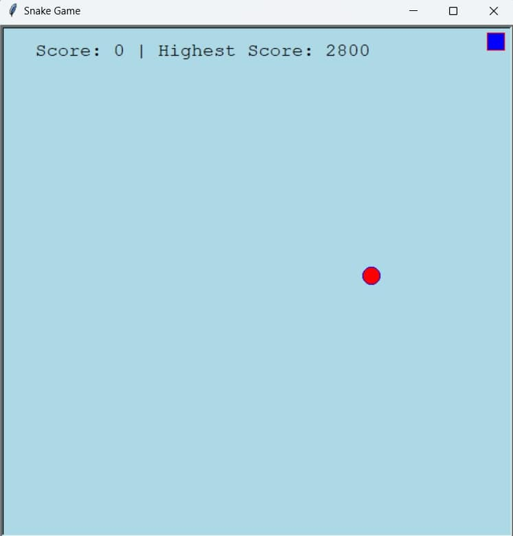
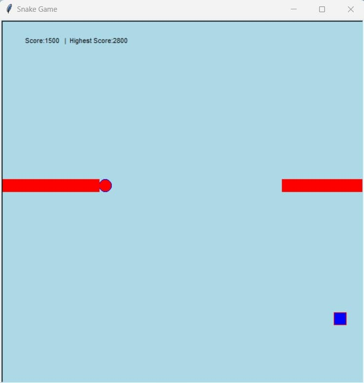

# Snake Game 🐍

A simple **Snake Game** built using **Python** and the **turtle** module.

---

## Features

* Move the snake using arrow keys: `Up`, `Down`, `Left`, `Right`.
* Eat the food to grow the snake.
* Score tracking and highest score display.
* Reset the game by pressing the `Spacebar`.
* Smooth animation with Python Turtle graphics.

---

## Requirements

* Python 3.x
* `turtle` module (built-in with Python)
* `random` module (built-in with Python)
* `time` module (built-in with Python)

---

## How to Run

1. Clone the repository:

```bash
git clone https://github.com/yourusername/Snake_game.git
```

2. Navigate to the project folder:

```bash
cd Snake_game
```

3. Run the game:

```bash
python snakegame2.py
```

> **Important:** Before closing the game window in IDLE, press the **Spacebar** to stop the game. Closing without stopping may cause an error (`turtle.Terminator`) in IDLE.

---

## Controls

* **Arrow keys:** Move the snake (`Up`, `Down`, `Left`, `Right`)
* **Spacebar:** Reset / Stop the game

---

## How to Play

1. Use arrow keys to move the snake around the screen.
2. Eat the food (red square) to grow the snake and increase your score.
3. Avoid hitting the snake’s own body; otherwise, the game will reset.
4. Your score and highest score are displayed at the top-left corner.

---

## Screenshot

## Screenshot





---

## License

This project is open-source and free to use.
